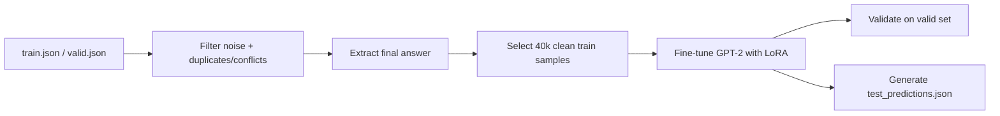

# viet-gpt2-math-word-problems

This project fine-tunes `NlpHUST/gpt2-vietnamese` for Vietnamese math word problems. The final pipeline uses an **answer-only** setup: given a Vietnamese question, the model generates only the final answer in a scoring-friendly format.

Final notebook:

[`notebooks/final_notebook.ipynb`](notebooks/final_notebook.ipynb)

## Pipeline Overview



Main ideas:

- Prompt format: `Câu hỏi: <query_vi>\nĐáp án:`.
- Training target is only the final answer, for example ` 42`, instead of a full reasoning trace.
- `query_vi` is the main input field; `response_vi` is used to extract the gold final answer.
- The two noisiest training types, `GSM_AnsAug` and `MATH_AnsAug`, are excluded from training.
- Additional filters remove overly long queries, overly long answers, heavy LaTeX/diagram queries, non-numeric answers, duplicates, and conflicting answers.
- Inference is model-only with greedy decoding. No rule solver or external API is used.

## Main Configuration

| Component | Value |
|---|---:|
| Variant | `v18_answer_only_drop_ansaug_only_clean40k` |
| Base model | `NlpHUST/gpt2-vietnamese` |
| Filtered train size | `40,000` samples |
| Max length | `256` |
| Epochs | `5` |
| Batch size | `8` |
| Gradient accumulation | `4` |
| Learning rate | `5e-4` |
| LoRA | `r=32`, `alpha=64`, `dropout=0.03` |
| Generation | greedy, `max_new_tokens=12` |

## Validation Results

Results are stored in [`outputs/`](outputs/):

| Metric | Value |
|---|---:|
| Validation samples | `997` |
| `raw_score` | `1989` |
| `score_10` | `1.995` |
| Exact score-10 count | `151` |
| Extract rate | `1.0` |

Detailed per-type validation results are available at [`outputs/valid_report_by_type.csv`](outputs/valid_report_by_type.csv).

## Project Structure

| Path | Description |
|---|---|
| `notebooks/final_notebook.ipynb` | Final notebook for training, validation, and prediction |
| `notebooks/Variants/` | Earlier experiment notebooks before the final pipeline |
| `data/` | Raw/processed data and data notes |
| `models/nlphust-gpt2-vietnamese/` | Offline Vietnamese GPT-2 base model |
| `outputs/` | Validation outputs and sample prediction output from the final run |
| `report/` | Final team report |
| `scripts/` | Preprocessing notebooks, EDA, demos, and dependency file |

## How To Run

Install dependencies:

```bash
python -m pip install -r scripts/requirements.txt
```

Run the final notebook:

```text
notebooks/final_notebook.ipynb
```

On Kaggle, attach the `dataset-math` dataset and the `nlphustgpt2-vietnamese` base model, enable GPU, and keep Internet OFF. For local runs, update path variables in the notebook such as `TRAIN_PATH_CANDIDATES`, `VALID_PATH_CANDIDATES`, `TEST_PATH_CANDIDATES`, and `MODEL_PATH_CANDIDATES` to match your local data/model locations.
